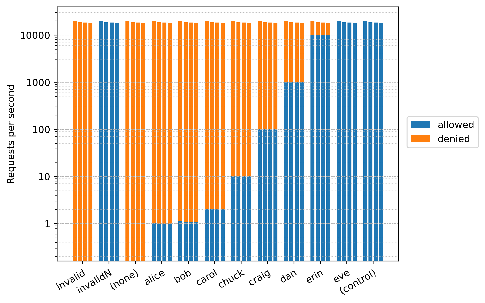

# Example Rate Limiter in Java

This project provides a rate limiting library and demonstrates its use within an HTTP server.  The core code is in [`RateLimiter.java`](ratelimiter/src/main/java/org/example/ratelimiter/RateLimiter.java) and the demonstration code is in [`Server.java`](server/src/main/java/org/example/server/Server.java).

## Design Principles and Requirements

* Must support per-user (or other requesting entity) quotas
* Must support multithreaded use without imposing a global synchronization point
* Must minimize latency overhead, especially for high throughput clients
* Should adapt to changing quotas

## Out of scope

* Global rate limiting across JVMs

## Design approach

At its core, this library implements the token bucket rate limiting pattern.  The token counter itself, the one that keeps track of available permits for a given quota ID, is an AtomicLong.  The "hot path" involves looking up the state object for the relevant quota ID in a Caffeine[1] cache, checking that the current monotonic time is still less than the volatile field that stores the end of the burst window for which the latest batch of tokens were released, and then decrementing and checking that the value of the AtomicLong was greater than zero to see if the request should be allowed.

If the time exceeds the burst window, the state object's mutex is locked and the AtomicLong is reset to the appropriate number of tokens for the now-current burst window given the quota for the ID.  The quota itself is fetched and occasionally re-fetched asynchronously so that governed requests need never be blocked due to a quota fetch.  This means that during cold-start for a given quota ID, the first and any other requests that come in before the quota fetch is complete are governed instead by a globally-configured "failsafe quota".  Users of the library can set that high if they are confident that the fetch will be quick, or low (even zero) if they want to limit their exposure, though that might mean rejecting valid requests until the quote fetch completes.  Library users also have the option to implement the async fetch synchronously, in which case those early requests will block instead of fail.  I imagine that the "failsafe quota" would be best set to a significant fraction of the request capacity of a given node or the max quota allowed for any ID.  The idea is to "fail open" so that if the quota fetch mechanism is failing, it doesn't lock clients out.  If the fetch mechanism fails after the first fetch, the previously-fetched (stale) quota for that ID continues to be used.

[1] [Caffeine](https://github.com/ben-manes/caffeine) is a well-known and excellent concurrent linked hash map implementation that manages entry lifetimes while providing lockless lookups of existing entries and that stripes mutations across multiple locks to reduce contention.

## Dependencies

* JDK version 21 or greater (some earlier versions might work)
* [wrk](https://github.com/wg/wrk) for running tests against a local server instance

## Building

```console
$ ./gradlew build
```

## Running

```console
$ ./gradlew -q --console=plain run
serving on localhost:8080
```

## Testing

While it is possible to test the server with `curl` or other single-request tools, the rate limiting functionality is more easily demonstrated using a load testing tool such as `wrk`.  In the below example, `wrk` is used to perform as many requests as it can using 100 concurrent connections over the course of 10 seconds.  The results show that it made 2713986 total requests, 2713976 of which resulted in non-successful HTTP status codes.  The remaining 10 requests were therefore successful.  Given that `alice@example.com` is assigned a quota of 1.0 requests per minute in [`Server.java`](server/src/main/java/org/example/server/Server.java), this is the expected result.

```console
$ wrk -t1 -c100 -d10s -H 'X-Account-ID: alice@example.com' http://localhost:8080/
Running 10s test @ http://localhost:8080/
  1 threads and 100 connections
  Thread Stats   Avg      Stdev     Max   +/- Stdev
    Latency   198.58us   85.81us   2.35ms   82.73%
    Req/Sec   272.95k    53.26k  326.46k    85.00%
  2713986 requests in 10.00s, 176.00MB read
  Non-2xx or 3xx responses: 2713976
Requests/sec: 271300.50
Transfer/sec:     17.59MB
```

[`wrk-test/test.py`](wrk-test/test.py) provides a more comprehensive `wrk`-based test suite that simulates many simultaneous users making requests against a single server instance.  It also collects and collates more detailed statistics and presents them as a consolidated dataset conducive to analysis.  The script runs four trials of 1,000 seconds for each user profile, one immediately after the other.  The user profile test sequences are all run concurrently with each other, so the entire test requires just over 4,000 seconds to run.

The set of user profiles tested comprises one for each rate limit entry listed in `Server.java` plus ones for `invalid@example.com`, `invalidN@example.com`, and `admin@example.com`.  The `ANONYMOUS` entry listed in `Server.java` is used when no account ID was provided in the request.  `invalid@example.com` represents the case in which a specific account ID is consistently provided in the request, but there is no rate defined for it in `Server.java`.  `invalidN@example.com` simulates a denial-of-service attack in which a unique invalid account ID is provided with each request.  Lastly, the `admin@example.com` profile acts as an experimental control by bypassing the rate limiter altogether.

## Analysis

Sample results from a run of the `wrk`-based test script can be found in [results.tsv](wrk-test/results.tsv), and a script to chart the results is available in [chart.py](wrk-test/chart.py).  Charting the observed allow and deny rates from the sample run (see below) shows that the rate limiter has the expected effect.  Note that `invalidN` requests are always allowed because, as configured by `Server.java`, the rate limiter grants each new ID a non-zero "failsafe" quota to avoid denying access while asynchronously retrieving the correct quota.  The failsafe quota also allows a small number of requests for the `invalid` profile at the start of the first trial as can be seen in `results.tsv` though it is imperceptible in the chart.  Other strategies to prevent abuse supported by this library include denying by default, making a synchronous request for the quota, or adding additional rate limiters on other types of identifiers (e.g., source IP address).  The sample results also show that the total number of requests served is evenly distributed across user profile test sequences.  Close examination reveals that the first trial of each profile completes a slightly higher number of requests than the other trials.  As this is consistent across test runs as long as the server is started fresh for each test, it is presumably an artifact due to deferred garbage collection during server warm-up.



### Performance impact

The above confirms that the rate limiting logic behaves as expected.  But what's the cost, especially in terms of additional request latency?  The below chart shows the observed latencies across each of the profiles.  They are plotted separately for each trial, because the server's intrinsic latency profile changes as it warms up, optimizing and stabilizing both garbage collection and just-in-time (JIT) compilation.  By comparing the observed latencies across the user profiles, these plots show that the latency for the control profile does not vary significantly from the latencies seen across all treatment profiles.


### Memory overhead

The rate limiter must maintain state for each unique quota ID (e.g., per user account ID).  The number of unique IDs presented to the limiter combined with the retention times required to ensure that their quotas are maintained determines the number of state entries the limiter must retain at a given time.  The retention time for the state associated with a given quota is the larger of the burst window duration or the average period of time it takes for a unit of quota to become available (quota window duration divided by the quota), limited by the configured maximum retention duration.

A denial-of-service attack, intentional or not, can poison the rate limiting state map with entries it must maintain to efficiently deny.  This makes essential the placement of a limit on the total number of entries the map will maintain, lest it grow to overly burden the garbage collector and eventually cause an out-of-memory exception.  When this limit is hit, the implementation will preferentially evict the least frequently used entries -- the ones it is least likely to see again anyway.

All of this means that the amount of memory consumed per active quota is an important parameter to consider when configuring the rate limiter.  The below analysis shows that in a 64-bit JVM, each entry will consume 248 bytes + the size of the quota ID as expressed in Latin-1 or UTF-16.  Future work might reduce this overhead somewhat, for instance by collapsing the fields of the Quota object into the State object or using alternate implementation objects when certain features are not required.

```elisp
(+
  88 ; map entry (see https://github.com/ben-manes/caffeine/wiki/Memory-overhead)

  12 ; State object header
   4 ; padding
   8 ; private final long originTick;
   8 ; private volatile long permitsForBurstWindow;
   8 ; private volatile long burstWindowEndTick;
   8 ; private volatile long retentionTicks;
   4 ; (compressed reference) private final Quota quota;
   4 ; (compressed reference) private final AtomicLong availablePermits = new AtomicLong();

  12 ; AtomicLong object header
   4 ; padding
   8 ; the long itself

  12 ; Quota object header
   4 ; padding
   8 ; private volatile double value;
   8 ; private volatile long lastFetchStartTick = Long.MIN_VALUE;
   1 ; private boolean fetchInProgress;
   7 ; padding

  12 ; String object (for key) header
   4 ; private int hash;
   1 ; private final byte coder;
   1 ; private boolean hashIsZero;
   2 ; padding
   4 ; (compressed reference) private final byte[] value;

  12 ; byte[] header
   4 ; length
  32 ; presumed average actual key size, assumed to be 32 latin-1 chars (e.g. a UUID) or 16 UTF-16 chars
)
280
```
